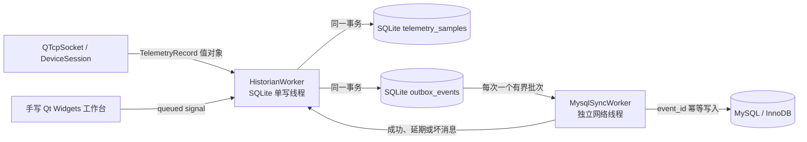

# Qt 5 工业数据库学习用例

本目录是一条从 SQLite 入门到 MySQL 工程化同步的可运行学习路径，目标环境为 Qt 5.15.13、C++17、CMake 和 WSL Ubuntu。它不是“打开数据库后执行一条 SELECT”的演示，而是一个缩小后的上位机历史库：TCP 遥测先可靠落到本机 SQLite，再通过事务 outbox 幂等同步到中心 MySQL。MySQL 离线时，本地采集仍可继续。

## 先理解系统边界



关键约束：

- 每个 `QSqlDatabase` 在使用它的线程内创建、使用、关闭；连接不跨线程传递。
- UI、TCP 和数据库层只交换值对象，不交换 `QSqlQuery`、连接句柄或裸数据指针。
- SQLite 只有一个生产写入者。WAL 允许读写并发，但不意味着多个写入者能并行提交。
- 遥测行与 outbox 事件在一个 SQLite 事务中提交，避免“本地已写、同步事件丢失”的双写裂缝。
- `event_id` 是端到端幂等键。网络重试采用至少一次投递，数据库唯一键把重复投递收敛为一行。
- MySQL 的连接和查询可能阻塞，所以它拥有独立线程；中心库故障不能耗尽本地采集线程的事件队列。
- 所有队列和批次都有上限。过载必须可观测，并明确选择背压、落盘或丢弃策略。

Qt 5 文档要求数据库连接只在创建它的线程中使用；`QSqlDatabase` 又是共享连接状态的值句柄，销毁引用后才能安全 `removeDatabase()`。本例把这些规则集中在 `DatabaseSession` 与 worker 生命周期中，而不是要求每个调用点记住细节：[Qt 5 SQL 线程规则](https://doc.qt.io/qt-5/threads-modules.html)、[QSqlDatabase 生命周期](https://doc.qt.io/qt-5/qsqldatabase.html)。

## 源码导读

| 代码 | 应重点学习的设计 |
|---|---|
| `common/DbTypes.*` | 配置、错误分类、跨线程 DTO、输入不变量 |
| `common/DatabaseConfigLoader.*` | JSON 是声明式配置；默认值、类型检查、未知键边界 |
| `infrastructure/DatabaseSession.*` | 命名连接、线程亲和、驱动选项、凭据环境变量、确定性清理 |
| `infrastructure/TransactionGuard.*` | RAII 回滚；只有显式 `commit()` 才成功 |
| `infrastructure/MigrationRunner.*` | 有序迁移、SHA-256 校验和、不可篡改的已应用历史 |
| `schema/HistorianSchema.*` | SQLite 与 MySQL 方言隔离、外键、约束与复合索引 |
| `repositories/HistorianRepository.*` | 预编译绑定、批事务、keyset 分页、outbox 和幂等写 |
| `workers/HistorianWorker.*` | SQLite 单写者、有界内存队列、定时/阈值批处理 |
| `workers/MysqlSyncWorker.*` | 阻塞边界、断线退避、坏消息隔离、批次确认 |
| `workstation/*` | 手写布局、dock、Model/View、异步查询与运行指标 |
| `collector/HistorianCollector.cpp` | 把 TCP 用例与数据库用例串成实际上位机数据通路 |
| `tests/*` | 迁移、回滚、锁竞争、worker、MySQL 契约测试 |

## WSL 安装与编译

```bash
sudo apt-get update
sudo apt-get install -y \
  build-essential cmake ninja-build gdb sqlite3 \
  qtbase5-dev qtbase5-dev-tools libqt5sql5-sqlite libqt5sql5-mysql

cmake --preset linux-debug
cmake --build --preset linux-debug
ctest --preset linux-debug --output-on-failure
```

先确认运行时和插件，而不是只确认“安装过 Qt”：

```bash
./build/linux-debug/examples/database/DatabaseDriverProbe
```

预期包含 Qt `5.15.x`、`QSQLITE`、`QMYSQL` 和 SQLite 运行时版本。编译成功不代表动态插件一定能加载，插件诊断见 [DEBUGGING_zh.md](DEBUGGING_zh.md)。

## 运行 SQLite 工作台

配置默认关闭 MySQL，所以第一次实验无外部依赖：

```bash
./build/linux-debug/examples/database/DatabaseWorkbench \
  --config examples/database/config/database_lab.json
```

点击 `Start lab stream`，观察内存队列、持久化计数和 flush 延迟；再用 `Query SQLite history` 查看 keyset 查询的第一页。数据库文件路径相对于进程工作目录，不相对于配置文件。真实产品应在加载配置时把它规范化为明确的应用数据绝对路径。

无图形会话的生命周期冒烟测试：

```bash
QT_QPA_PLATFORM=offscreen \
./build/linux-debug/examples/database/DatabaseWorkbench \
  --config examples/database/config/database_lab.json --exit-after-ms 1500
```

## 启动 MySQL 8.4 实验库

先创建未纳入版本控制的密码：

```bash
cd examples/database/docker/secrets
umask 077
printf '%s\n' '替换为随机密码' > mysql_app_password
cd ..
docker compose up -d
docker compose ps
```

随后在应用终端设置凭据并使用已启用 MySQL 的配置：

```bash
export DEVICESTUDIO_MYSQL_PASSWORD="$(< examples/database/docker/secrets/mysql_app_password)"
./build/linux-debug/examples/database/DatabaseWorkbench \
  --config examples/database/config/database_mysql_lab.json
```

配置只保存环境变量名称，不保存密码。`MYSQL_OPT_RECONNECT=FALSE` 是有意选择：静默自动重连可能使事务状态变得模糊；worker 在明确边界关闭旧连接、重新迁移检查并重试 outbox。

运行真实契约测试：

```bash
export DEVICESTUDIO_RUN_MYSQL_TESTS=1
ctest --test-dir build/linux-debug -R database_mysql_contract \
  --output-on-failure
```

该测试会应用迁移、重复提交同一 UUID、断言中心库只存在一行，然后只清理由测试生成的 UUID。没有显式开关时测试显示 `Skipped`，因此普通单元测试不偷偷依赖本机服务。

## TCP 到数据库的完整链路

终端 A：

```bash
./build/linux-debug/examples/tcp/TcpDeviceSimulator \
  --port 45455 --telemetry-ms 100
```

终端 B：

```bash
./build/linux-debug/examples/database/HistorianCollector \
  --database-config examples/database/config/database_lab.json \
  --host 127.0.0.1 --port 45455
```

终端 C：

```bash
sqlite3 device-history.db \
  "SELECT device_id, COUNT(*), MIN(captured_at_ms), MAX(captured_at_ms) \
   FROM telemetry_samples GROUP BY device_id;"
```

这条链路练习 TCP 流解析、跨线程排队、批量事务、停机 flush 和持久化诊断。启用 MySQL 后，再比较两端 `event_id` 数量，而不是假设两个数据库在每一毫秒都强一致。

也可以运行自动化冒烟脚本；它使用唯一临时目录，不覆盖现有数据库：

```bash
bash examples/database/scripts/smoke_tcp_sqlite.sh.recover "$PWD"
```

## 工程决策速查

| 问题 | 默认决策 | 何时改变 |
|---|---|---|
| 本机缓存还是中心库直写 | 先 SQLite，再异步 MySQL | 数据可丢且网络永远可靠的非工业工具 |
| 每条提交还是批量事务 | 时间阈值与行数阈值二者先到 | 极低吞吐且每条都要求立即断电持久化 |
| offset 还是 keyset 分页 | 复合游标 `(time,event_id)` | 很小、静态、只用于后台管理的数据集 |
| 精确一次还是至少一次 | 至少一次 + 幂等键 | 跨系统有成熟事务协调器且成本合理 |
| 一个数据库线程还是线程池 | SQLite 单写线程；MySQL 专用同步线程 | 经基准证明读查询隔离有价值，再增加只读连接 |
| SQL 字符串拼接还是绑定 | 值始终绑定；仅白名单控制结构片段 | 不改变 |

## 资料依据

- [Qt 5 QSqlDatabase](https://doc.qt.io/qt-5/qsqldatabase.html)：连接命名、事务、关闭和移除连接的约束。
- [Qt 5 SQL driver](https://doc.qt.io/qt-5/sql-driver.html)：QSQLITE/QMYSQL 插件与连接选项。
- [SQLite WAL](https://www.sqlite.org/wal.html)：读写并发、单写者、checkpoint 与 WAL 文件生命周期。
- [SQLite transactions](https://www.sqlite.org/lang_transaction.html)：隐式/显式事务和锁升级语义。
- [MySQL 8.4 deadlock handling](https://dev.mysql.com/doc/refman/8.4/en/innodb-deadlocks-handling.html)：小事务、一致加锁顺序、索引和完整事务重试。
- [MySQL 8.4 EXPLAIN](https://dev.mysql.com/doc/refman/8.4/en/explain.html)：验证执行计划，而不是凭感觉加索引。

继续按 [LABS_zh.md](LABS_zh.md) 做实验；故障定位使用 [DEBUGGING_zh.md](DEBUGGING_zh.md)；数据模型与同步算法见 [SCHEMA_AND_SYNC_zh.md](SCHEMA_AND_SYNC_zh.md)。
